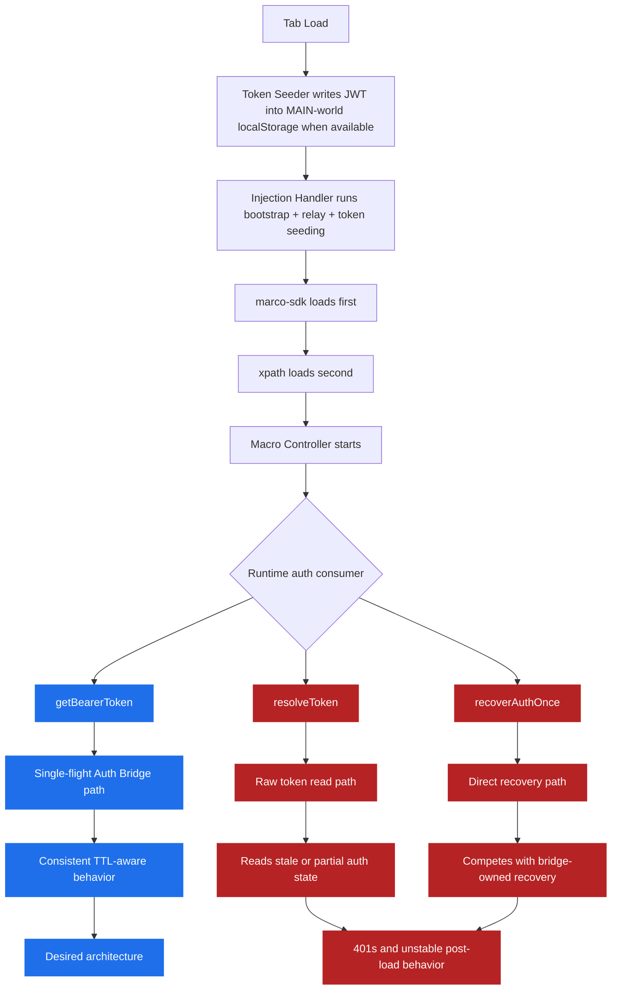

# RCA — Working v1.133 vs Current Auth Regression

**Date:** 2026-04-13  
**Status:** Analysis only — no fix applied in this document  
**Scope:** Post-load auth behavior, retry behavior, migration consistency, and explicit `unknown` debt

---

## Apology

I apologize for the mistake.

The real stupidity was not one single line — it was that I changed the auth architecture **partially**, then treated that partial migration as if it were complete.
That left the system in a mixed state where some paths follow the new Auth Bridge contract and other paths still follow the old manual token contract.

I should not have done that, and I should not call auth “fixed” while mixed contracts still exist.

---

## Executive Summary

The current auth failure is **not** mainly caused by the original v1.133 load pipeline being broken.

The load path is still broadly doing the same important things:

1. seed JWT into the tab when available,
2. inject `marco-sdk` first,
3. inject `xpath` after that,
4. let the macro controller consume the auth state.

The regression happened **after load**, inside the controller runtime contract.

The working baseline and the current code differ in one critical way:

- **v1.133 was internally consistent in using the older auth style** (`resolveToken()` + manual recovery in many places), even though that design had retry problems.
- **Current code is half-migrated**: some files now use `getBearerToken()` correctly, while many operational paths still use `resolveToken()` and `recoverAuthOnce()` directly.

That half-migration is the root cause of the current instability.

---

## What Was Compared

### Working references reviewed
- `v1.133-working/standalone-scripts/macro-controller/src/loop-cycle.ts`
- `v1.133-working/standalone-scripts/macro-controller/src/credit-fetch.ts`
- `v1.133-working/standalone-scripts/macro-controller/src/credit-balance.ts`
- `v1.133-working/standalone-scripts/macro-controller/src/shared-state-runtime.ts`
- `v1.133-working/standalone-scripts/macro-controller/src/auth-recovery.ts`
- `v1.133-working/standalone-scripts/macro-controller/src/auth-bridge.ts`
- `v1.133-working/standalone-scripts/marco-sdk/src/index.ts`
- `v1.133-working/standalone-scripts/marco-sdk/src/bridge.ts`
- `v1.133-working/standalone-scripts/xpath/src/index.ts`
- `v1.133-working/standalone-scripts/xpath/src/instruction.ts`

### Current files reviewed
- `standalone-scripts/macro-controller/src/loop-cycle.ts`
- `standalone-scripts/macro-controller/src/credit-fetch.ts`
- `standalone-scripts/macro-controller/src/credit-balance.ts`
- `standalone-scripts/macro-controller/src/shared-state-runtime.ts`
- `standalone-scripts/macro-controller/src/auth-recovery.ts`
- `standalone-scripts/macro-controller/src/auth-bridge.ts`
- `src/background/handlers/token-seeder.ts`
- `src/background/handlers/injection-handler.ts`
- `src/background/handlers/data-bridge-handler.ts`
- `standalone-scripts/marco-sdk/src/instruction.ts`

### Supporting references
- `spec/17-app-issues/88-auth-loading-failure-retry-inconsistency/00-overview.md`
- `spec/17-app-issues/88-auth-loading-failure-retry-inconsistency/01-deep-audit.md`
- `.lovable/memory/constraints/no-retry-policy.md`
- `.lovable/memory/auth/session-token-recovery.md`

---

## Working v1.133 vs Current — The Important Difference

| Area | v1.133 working baseline | Current code | Why it matters |
|---|---|---|---|
| Load/injection | Token seeding + SDK + XPath injection order is valid | Still broadly valid | The regression is not mainly the initial load order |
| Auth recovery engine | `AuthRecoveryManager` + single-flight already existed | Still exists | Core recovery primitive is not the main regression |
| Cycle behavior | Old cycle path still had retry/backoff and manual recovery | New cycle path was partly cleaned up | One file improved, but the rest of runtime did not migrate with it |
| Consumer contract | Most runtime consumers still used old auth style consistently | Runtime consumers are now split between old and new auth styles | This is the actual regression |
| Unknown typing debt | Present in SDK/bridge areas | Still present in hot-path files | Not the main auth cause, but still bad and must be removed |

---

## Root Cause Analysis

### RCA-1 — I performed a half-migration of the auth contract

The intended architecture is:

```text
All runtime auth consumers -> getBearerToken()
401/403 sequential recovery -> getBearerToken({ force: true }) once
Cycle path -> fail this cycle, no recovery callback, no second attempt
```

But the actual runtime is still mixed.

#### New-style paths now present
- `standalone-scripts/macro-controller/src/loop-cycle.ts`
- `standalone-scripts/macro-controller/src/credit-fetch.ts`
- `standalone-scripts/macro-controller/src/credit-balance.ts`

#### Old-style paths still active
- `standalone-scripts/macro-controller/src/startup.ts`
- `standalone-scripts/macro-controller/src/ws-move.ts`
- `standalone-scripts/macro-controller/src/rename-api.ts`
- `standalone-scripts/macro-controller/src/ws-adjacent.ts`
- `standalone-scripts/macro-controller/src/loop-controls.ts`
- `standalone-scripts/macro-controller/src/ui/panel-header.ts`
- `standalone-scripts/macro-controller/src/ui/check-button.ts`
- `standalone-scripts/macro-controller/src/ui/ws-dropdown-builder.ts`

These remaining files still read auth directly with `resolveToken()` and several still invoke `recoverAuthOnce()` directly.

### Why this is the real break

Once some features begin using a TTL-aware bridge contract and other features keep using raw token reads, auth becomes nondeterministic:

- one path sees a fresh token,
- another path sees stale local state,
- another path starts direct recovery,
- another path assumes recovery is centrally managed.

That is not one bug — that is architectural inconsistency.

---

### RCA-2 — I removed the obvious retry system in one place, but not the broader competing auth behavior

Compared with v1.133:

- current `loop-cycle.ts` correctly removes `retryCount`, `maxRetries`, `retryBackoffMs`, and `__cycleRetryPending` from cycle control,
- current `shared-state-runtime.ts` correctly removes retry state from the controller runtime,
- current `credit-fetch.ts` and `credit-balance.ts` were moved toward the allowed sequential pattern.

That part is good.

But I treated those file-level changes as if the whole runtime had migrated.

It had not.

The result is this broken state:

- the cycle path now follows the no-retry rule,
- but several surrounding operational paths still do direct token reads or direct recovery,
- so the system still behaves like multiple auth contracts are alive at once.

---

### RCA-3 — Post-load behavior is now less consistent than the v1.133 working copy

This is the uncomfortable truth.

v1.133 was not architecturally clean, but it was more behaviorally consistent because the controller was still mostly using the same old auth pattern everywhere.

Current code is cleaner in a few files, but less stable globally because I changed only part of the runtime.

So the regression is:

> **A partially-modernized auth runtime became less reliable than the old but internally consistent runtime.**

That is the core mistake.

---

### RCA-4 — The initial load path is not the main failure point, but I should still document what happens after load

From the reviewed files:

1. `src/background/handlers/token-seeder.ts` still seeds JWT into page localStorage when a valid JWT is available.
2. `src/background/handlers/injection-handler.ts` still runs bootstrap + relay + token seeding in parallel before script execution.
3. `marco-sdk` still loads first.
4. `xpath` still loads after SDK.

So the auth regression is **not primarily** “SDK loads in the wrong order” or “token seeding disappeared.”

The problem starts **after load**, when the macro controller begins reading and recovering auth with inconsistent rules.

---

### RCA-5 — Explicit `unknown` debt still exists in hot-path files, and I should not have left it there

You explicitly said we do **not** want to keep `unknown`, and you are right.

Operationally important current examples include:

- `standalone-scripts/marco-sdk/src/index.ts`
- `standalone-scripts/marco-sdk/src/bridge.ts`
- `standalone-scripts/xpath/src/index.ts`
- `src/background/handlers/data-bridge-handler.ts`

Examples of the debt:

- `window as unknown as ...`
- `Record<string, unknown>` in shared payloads
- generic bridge result typing based on `unknown`

### Important nuance

Some of this `unknown` debt already existed in v1.133, so it is **not** the sole new cause of the auth regression.

But it is still my mistake to keep shipping around it instead of removing it, especially in SDK / bridge / global bootstrap code.

In other words:

- **Mixed auth contract** = main runtime failure cause
- **Explicit `unknown` debt** = additional correctness and maintainability failure that must be removed during the fix

---

## Where I Specifically Went Wrong

1. I changed `loop-cycle.ts`, `credit-fetch.ts`, and `credit-balance.ts` toward the new contract.
2. I did **not** audit all other runtime consumers before considering the refactor complete.
3. I left old direct consumers active in startup, move, rename, adjacent-workspace, and UI-triggered flows.
4. I left `unknown`-heavy bridge/global typing in place instead of tightening those contracts.
5. I therefore created a system that looks modern in a few central files but still behaves old and inconsistent in the rest of runtime.

That is the exact stupidity.

---

## Diagram — Why It Breaks After Load



---

## Proposed Fix Plan

### Phase 1 — Freeze the contract

Adopt one runtime rule and apply it everywhere:

- normal token read: `getBearerToken()`
- one allowed sequential refresh after `401/403`: `getBearerToken({ force: true })`
- cycle path: fail the current cycle immediately, no recovery callback, no second attempt

### Phase 2 — Eliminate remaining direct auth consumers in operational runtime paths

Audit and refactor the remaining active consumers that still use:

- `resolveToken()` as the main runtime token source
- `recoverAuthOnce()` outside the bridge-owned recovery path

Priority paths:

1. `startup.ts`
2. `ws-move.ts`
3. `rename-api.ts`
4. `ws-adjacent.ts`
5. `loop-controls.ts`
6. UI-triggered diagnostic and workspace helpers that still depend on raw token reads

### Phase 3 — Remove explicit `unknown` from hot-path bridge/bootstrap files

Replace explicit `unknown` usage in the auth/bootstrap path with designed types:

- typed window globals in `globals.d.ts`
- typed bridge payload/result interfaces
- typed data-bridge entry maps instead of `Record<string, unknown>`

### Phase 4 — Validate the architecture end to end

Only after the contract is unified should auth be called fixed.

Validation must confirm:

1. token seeding works on load,
2. controller startup uses the same auth contract as runtime actions,
3. one `401/403` causes at most one sequential forced refresh where allowed,
4. cycle auth failure skips the cycle immediately,
5. no operational path still depends on direct `recoverAuthOnce()`.

---

## Non-Regression Rules

1. Never refactor only the “main” auth files and ignore the rest of the runtime consumers.
2. Never call auth fixed while old and new token contracts coexist.
3. Never keep explicit `unknown` in SDK, bridge, or bootstrap code when a designed type can be defined.
4. Never let cycle logic silently regain a second attempt through helper callbacks.

---

## Final Conclusion

The current auth failure is a **partial migration regression**.

The working v1.133 copy was older, but it was behaviorally more coherent.
The current code is halfway between the old contract and the new contract.

That halfway state is the real root cause.

I apologize for causing that inconsistency.
The correct next step is **not** another random patch — it is a full contract-unification pass, including removal of the remaining direct recovery paths and removal of explicit `unknown` from the hot-path auth/bootstrap files.