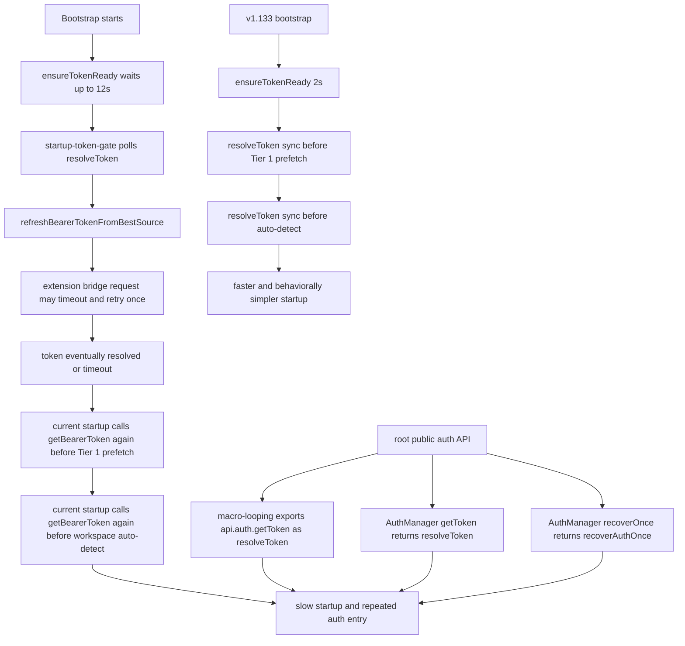

# RCA — Startup Latency + Root Auth Contract Regression

**Date:** 2026-04-13  
**Status:** Analysis only — no fix applied in this document  
**Scope:** Why the controller is still not working reliably and is no longer fast to load, even after the auth-unification refactor

---

## Apology

I apologize again.

The previous RCA was incomplete.
I focused too much on **mixed auth consumers** and not enough on the deeper problem:

> the **startup path** and the **controller’s root auth wiring** are still anchored to the old synchronous `resolveToken()` contract, while the new runtime now adds a much slower async readiness gate plus repeated post-gate `getBearerToken()` calls.

That means I analyzed the leaves, but I did not identify the real trunk.
That was my mistake.

---

## Executive Summary

The main root cause is now clearer:

1. **v1.133 startup was short and mostly synchronous after the initial token gate**.
2. **Current startup waits much longer up front, then re-enters auth again multiple times after the gate**.
3. **The controller’s public/root auth surface still exposes `resolveToken()`**, so the migration never truly reached the top of the architecture.
4. The existing retry/auth diagram focused on **cycle retry inconsistency**, but it did **not** highlight the deeper startup problem:
   - long gate,
   - old root contract,
   - repeated auth re-entry after the gate.

So the issue is **not only** “some files still use old auth.”
The deeper issue is:

> **The system is now double-gated and double-resolved during startup, while the root controller API still exports the old auth contract.**

That is why it feels both **slow** and **still unreliable**.

---

## What I Compared

### Working baseline
- `v1.133-working/standalone-scripts/macro-controller/src/startup.ts`
- `v1.133-working/standalone-scripts/macro-controller/src/startup-token-gate.ts`
- `v1.133-working/standalone-scripts/macro-controller/src/macro-looping.ts`
- `v1.133-working/standalone-scripts/macro-controller/src/core/AuthManager.ts`
- `v1.133-working/standalone-scripts/macro-controller/src/auth-recovery.ts`
- `v1.133-working/standalone-scripts/macro-controller/src/auth-bridge.ts`

### Current code
- `standalone-scripts/macro-controller/src/startup.ts`
- `standalone-scripts/macro-controller/src/startup-token-gate.ts`
- `standalone-scripts/macro-controller/src/macro-looping.ts`
- `standalone-scripts/macro-controller/src/core/AuthManager.ts`
- `standalone-scripts/macro-controller/src/auth-recovery.ts`
- `standalone-scripts/macro-controller/src/auth-bridge.ts`
- `standalone-scripts/macro-controller/diagrams/inconsistencies/auth-retry-inconsistencies.mmd`
- `/mnt/documents/auth-retry-inconsistencies.mmd`

---

## The Main New Finding

### RCA-1 — The startup path regressed from a short gate into a long gate

#### v1.133 working behavior
In the working copy:
- `startup.ts:322` calls `ensureTokenReady(2000)`
- after that, startup stays mostly synchronous for token reuse:
  - `startup.ts:388` -> `const startupToken = resolveToken();`
  - `startup.ts:417` -> `const freshToken = resolveToken();`

That means v1.133 waited briefly for startup auth, then moved forward with the token already present in local state.

#### Current behavior
In current code:
- `startup.ts:329` calls `ensureTokenReady(AUTH_READY_TIMEOUT_MS)`
- `startup-token-gate.ts:35` sets `AUTH_READY_TIMEOUT_MS = 12_000`

So the startup auth wait is now **12 seconds max**, not 2 seconds.

That is already a major speed regression.

### Why this matters
The user asked for the extension to load **fast**.
A path that can legally wait 12 seconds before surfacing auth failure is fundamentally not equivalent to the working baseline.

---

### RCA-2 — After the long gate, startup enters auth again instead of using the resolved result

This is the deeper architectural problem I missed the first time.

#### Current startup re-enters auth after the gate
After `ensureTokenReady(...)` succeeds, current startup does **not** simply use the resolved token result.
Instead it enters auth again:

- `startup.ts:394` -> `getBearerToken().catch(() => '')`
- `startup.ts:426` -> `getBearerToken().then(...)`

So the current flow is effectively:

1. wait for startup gate,
2. resolve auth,
3. then call async auth again before Tier 1 prefetch,
4. then call async auth again before workspace auto-detect.

That is a **double-resolution startup shape**.

#### v1.133 did not do this
The working copy uses:
- `resolveToken()` before Tier 1 prefetch,
- `resolveToken()` before auto-detect.

So the working startup path was:
- short wait,
- then proceed.

The current path is:
- long wait,
- then re-open auth twice.

That is the main behavioral regression.

---

### RCA-3 — The root controller auth contract was never fully migrated

This is the most important structural finding.

Even after several auth refactors, the **public/root controller wiring still exports the old sync contract**:

- `standalone-scripts/macro-controller/src/macro-looping.ts:67`
  - `dualWrite('__loopGetBearerToken', 'api.auth.getToken', resolveToken);`
- `standalone-scripts/macro-controller/src/core/AuthManager.ts:19`
  - `getToken(): string { return resolveToken(); }`
- `standalone-scripts/macro-controller/src/core/AuthManager.ts:74`
  - `recoverOnce(): Promise<string> { return recoverAuthOnce(); }`

So even after leaf files were moved toward `getBearerToken()`, the architecture still exposes:
- **root read path** = `resolveToken()`
- **root recovery path** = `recoverAuthOnce()`

That means the migration was never truly rooted at the top.

### Why this matters
This is why the previous RCA was incomplete.
It is not just that some files were missed.
It is that the **controller’s own public auth surface still tells the rest of runtime to think in the old model**.

That makes partial leaf migration inherently unstable.

---

### RCA-4 — The startup gate and bridge retry stack amplify latency

The startup gate itself is not just a passive wait.
It polls `resolveToken()` and actively triggers refresh logic:

- `startup-token-gate.ts:80` -> immediate `resolveToken()`
- `startup-token-gate.ts:92` -> repeated `resolveToken()` polling
- `startup-token-gate.ts:59` -> `refreshBearerTokenFromBestSource(...)`

Inside that recovery path, the bridge still retries once on timeout:

- `auth-bridge.ts:223-245` -> `requestTokenFromExtension(...)`
- `auth-bridge.ts:235` -> `timed out — retrying once...`
- `auth-bridge.ts:29` -> `BRIDGE_TIMEOUT_MS = 5000`

So the current startup can enter a much slower chain:

- token gate polling,
- bridge GET token attempt,
- bridge timeout retry,
- bridge refresh attempt,
- bridge timeout retry,
- cookie fallback,
- then later startup calls `getBearerToken()` again anyway.

### Important note
This bridge retry logic also existed in the working copy.
So by itself it is **not** the new regression.

The regression is that current startup now gives that machinery **far more room to dominate startup time**, and then still re-enters auth after the gate.

---

### RCA-5 — The existing retry diagram pointed us at the wrong layer

The existing diagram (`auth-retry-inconsistencies.mmd`) is useful, but incomplete for this failure.
It focuses on:
- cycle backoff,
- recursive credit retry,
- retry-state fields,
- no-retry policy violations.

That diagram does **not** make the deeper startup regression obvious:
- startup gate grew from 2s to 12s,
- startup still depends on `resolveToken()` inside the gate,
- startup then calls `getBearerToken()` again after the gate,
- the root auth surface still exports `resolveToken()` and `recoverAuthOnce()`.

So the diagram helped explain the retry cleanup work,
but it did **not** explain why the app is still slow and still feels broken.

That is why the prior root cause analysis missed the real center of failure.

---

## Supporting Comparison Table

| Area | v1.133 working | Current | Why it matters |
|---|---|---|---|
| Startup gate timeout | `ensureTokenReady(2000)` | `ensureTokenReady(AUTH_READY_TIMEOUT_MS)` where timeout is `12_000` | Major latency regression |
| After-gate token reuse | `resolveToken()` | `getBearerToken()` called again | Startup re-enters auth instead of continuing |
| Tier 1 prefetch path | Sync token reuse | Async token reacquisition | Adds extra auth churn |
| Auto-detect path | Sync token reuse | Async token reacquisition | Adds another auth pass |
| Root/public auth API | Old sync contract | Still old sync contract | Migration never fully reached the top |
| Retry diagram coverage | Mostly adequate for retry bugs | Inadequate for startup latency bug | Diagnosis stayed too narrow |

---

## Revised Main Root Cause

The deeper root cause is:

> **The system was refactored at the consumer level, but not at the startup/root-contract level.**

That produced a startup sequence that is now worse than the working copy:

1. **longer startup auth wait**,
2. **old sync contract still inside the root wiring**,
3. **repeated async auth re-entry after the gate**,
4. **bridge retry latency still present underneath**.

So the current code is not failing only because of scattered mixed consumers.
It is failing because the **startup architecture itself is now internally contradictory**.

---

## Why It Still Does Not Feel Fast

Because the current startup path can do all of this before the user sees stable behavior:

1. wait up to 12s for token readiness,
2. poll `resolveToken()` repeatedly,
3. trigger bridge recovery waterfall,
4. retry bridge timeout once,
5. then call `getBearerToken()` again for Tier 1 prefetch,
6. then call `getBearerToken()` again for workspace auto-detect.

That is not a fast startup path.
That is a layered auth pipeline.

v1.133 was behaviorally simpler:
- short gate,
- immediate token reuse,
- proceed.

---

## Console Log Note

The provided console warning:

- `Unknown message type: RESET_BLANK_CHECK` from `https://cdn.gpteng.co/lovable.js`

does **not** appear to be the root cause of the macro-controller auth/startup regression.
It looks external to the controller auth path reviewed here.

---

## Diagram — The Deeper Startup Regression

---

## What The Previous RCA Missed

The previous RCA was directionally right about **mixed contracts**, but incomplete because it did not say this clearly enough:

- the **startup path itself** regressed,
- the **root controller auth API** still exposes the old contract,
- and the system now pays the cost of both the old and new models.

That is the bigger root cause.

---

## Fix Direction For Discussion Only

**No code changes in this document.**

If we proceed later, the fix discussion should start from these principles:

1. make startup fast again,
2. stop re-entering auth after the readiness gate,
3. migrate the root/public auth surface before leaf consumers,
4. make the diagrams match the real startup architecture.

---

## Conclusion

The deepest issue is not just “auth refactor incomplete.”
It is this:

> **I changed parts of runtime to the new auth model, but I left startup and the controller’s root auth surface fundamentally on the old model, while also increasing startup wait time from 2s to 12s.**

That is why it is still not working properly and why it no longer feels fast.
